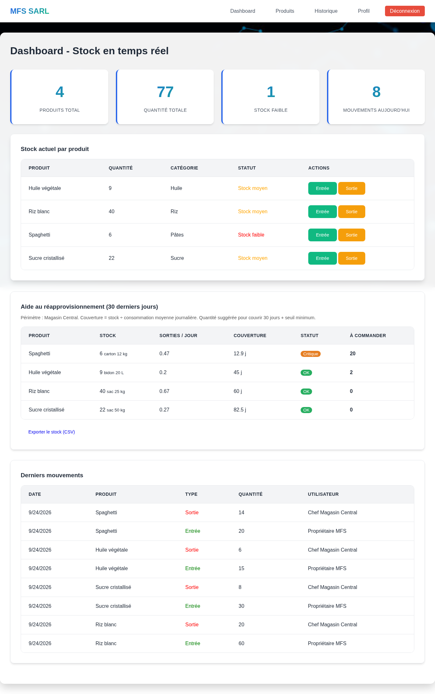
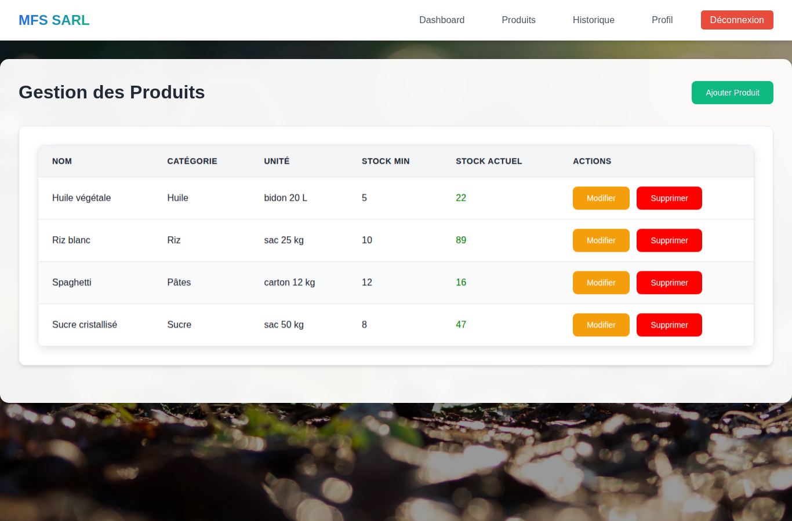
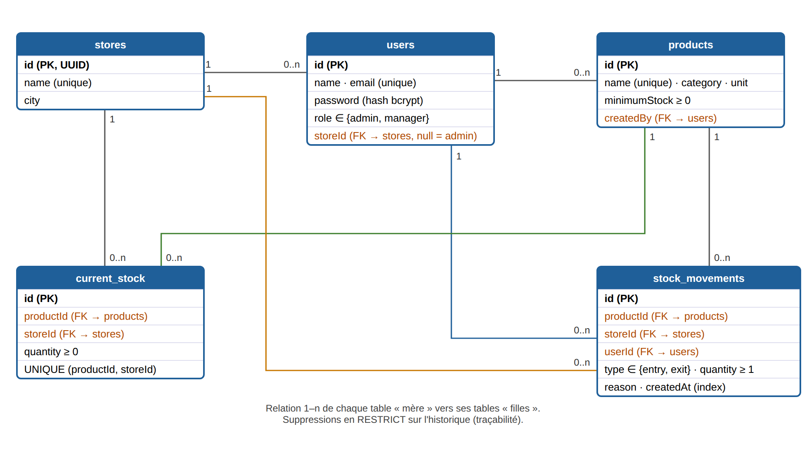

# MFS Stock — v4

Application web de **gestion de stock multi-magasins** pour distributeurs agroalimentaires (riz, sucre, huile, pâtes…).
Conçue à l'origine pour MFS SARL (Cotonou), dans le cadre du titre CDA (RNCP niveau 6).

   

## Aperçu



| Catalogue (vue propriétaire) | Modèle de données |
|---|---|
|  |  |

## Fonctionnalités

| Domaine | Ce que fait l'application |
|---|---|
| Stock | Stock courant **par magasin**, entrées / sorties en transaction, refus de tout stock négatif |
| Traçabilité | Journal des mouvements immuable (qui, quoi, quand, où, pourquoi) ; suppression d'un produit historisé impossible |
| Rôles | **Propriétaire (admin)** : tous les magasins, catalogue produits. **Chef de magasin** : uniquement son magasin |
| Aide à la décision | `/api/analytics/insights` : consommation moyenne/jour, couverture en jours, statut (rupture / critique / à surveiller / ok), quantité suggérée à commander |
| Exports | CSV compatibles Excel FR (stock courant, mouvements) |
| Vitrine | Site public + formulaire de contact (SMTP optionnel) |

## Démarrage rapide

```bash
npm install
cp .env.example .env            # puis renseigner JWT_SECRET (obligatoire)
npm run seed                    # base de démo : 3 magasins, 4 produits, 24 mouvements
npm start                       # http://localhost:3001
```

Comptes de démonstration (modifiables via `SEED_ADMIN_PASSWORD` / `SEED_MANAGER_PASSWORD`) :

| Rôle | Email | Mot de passe démo |
|---|---|---|
| Propriétaire | admin@mfs-sarl.com | Admin-Demo-2026 |
| Chef Magasin Central | chef1@mfs-sarl.com | Chef-Demo-2026 |
| Chef Magasin 2 / 3 | chef2@ / chef3@mfs-sarl.com | Chef-Demo-2026 |

### Avec Docker

```bash
cp .env.example .env && docker compose up -d --build
docker compose exec app node backend/database/seed.js
```

## Architecture

```
frontend/            HTML/CSS/JS (présentation) — servi par Express
backend/
  app.js             assemblage Express (helmet, CORS, routes, erreurs)
  server.js          démarrage + connexion base
  config/            variables d'environnement, connexion Sequelize
  routes/            contrôleurs REST (auth, products, stock, dashboard, analytics, stores, contact)
  services/          logique métier (stockService : mouvements, agrégations, indicateurs) + CSV
  middleware/        authentification JWT, rôles, validation, gestion d'erreurs
  models/            modèles Sequelize : Store, User, Product, CurrentStock, StockMovement
  database/seed.js   jeu de données de démonstration
tests/               Jest + Supertest (base SQLite en mémoire)
```

Couches : **présentation → routes → services → modèles (ORM) → SQLite**. Changer de SGBD (PostgreSQL/MySQL) ne demande que de modifier `config/database.js`.

## API

| Méthode | Route | Accès |
|---|---|---|
| POST | `/api/auth/login` | public (limité à 10 essais / 15 min / IP) |
| GET | `/api/auth/me` | connecté |
| POST | `/api/auth/change-password` | connecté (10 caractères min.) |
| GET | `/api/products` | connecté |
| POST / PUT / DELETE | `/api/products[/:id]` | admin |
| GET | `/api/stock/current` · `/api/stock/movements` | connecté (périmètre du magasin) |
| POST | `/api/stock/movements` | connecté (`{productId, type: entry\|exit, quantity ≥ 1, reason}`) |
| GET | `/api/stock/export/current.csv` · `/movements.csv` | connecté |
| GET | `/api/dashboard/stats` | connecté |
| GET | `/api/analytics/insights?days=30&targetDays=30` | connecté |
| GET / POST | `/api/stores` | connecté / admin |
| POST | `/api/contact` | public (5 messages / h / IP) |
| GET | `/api/health` | public |

## Sécurité

- Mots de passe **bcrypt (12 tours)**, jamais renvoyés par l'API (scope Sequelize par défaut)
- **JWT** signé (secret obligatoire, pas de valeur par défaut), expiration 8 h
- **Contrôle d'accès** par rôle et par magasin, vérifié côté serveur
- **Validation stricte** des entrées + liste blanche des champs (pas d'assignation de masse)
- **Helmet** (CSP, nosniff, etc.), CORS restreint, corps JSON limité à 100 ko
- **Rate limiting** sur la connexion et le formulaire de contact
- Échappement HTML côté front (anti-XSS stocké) et dans les emails ; CSV protégé contre l'injection de formules
- Erreurs centralisées : aucun détail technique renvoyé au client
- `.env` exclu du dépôt ; conteneur exécuté sans root

## Qualité / CI

```bash
npm test               # 33 tests (unitaires + intégration API)
npm run test:coverage  # ~80 % des instructions
npm run audit          # npm audit (dépendances de production)
```

- **GitHub Actions** (`.github/workflows/ci.yml`) : tests sur Node 20 et 22, audit, build Docker + smoke test
- **Jenkins** (`jenkins/Jenkinsfile`) : même pipeline + déploiement `docker compose` sur `main`

## Feuille de route

- Transferts inter-magasins, inventaires physiques (écarts), prix d'achat → valorisation du stock
- Alertes SMS / WhatsApp sur rupture
- Mode multi-entreprises (SaaS) pour d'autres importateurs-distributeurs (Bénin, Togo, Côte d'Ivoire)
- Tableau de bord Power BI branché sur les exports / l'API

---
Auteur : Meyroll DADJO HOUEGBAN
